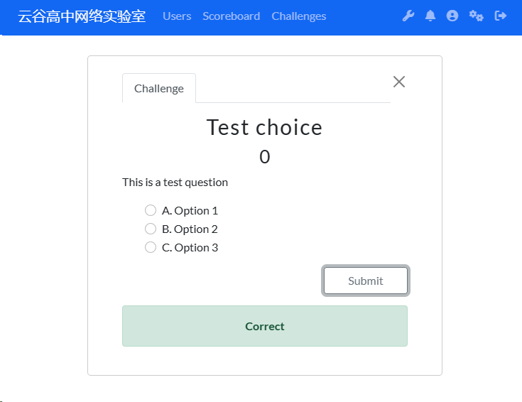

# ctfd-plugin-choice-challenge

This plugin is attended to set up single choice or multi choice quesiton, for [CTFd](https://github.com/CTFd/CTFd/blob).
 

### IMPORTANT NOTICE:

This plugin refer to https://github.com/ericdum/CTFd until it's merge to the main repository of CTFd/CTFd

I noticed there is some difference between CTFd's themes, e.g. it's not supporting CTFd._internal.challenge.submit while using core-beta theme, which I was developed this plugin with.

And some other theme may support CTFd._internal.challenge.submit, but this plugin is not implemented.

### Quickstart

1. Clone this repository to your {root of CTFd}/CTFd/plugins
2. Restart 

### File Structure

1. __init__.py: Define and config the model, but it is just as same as the basic model.
2. assets/: Contains all the template file and js file.
